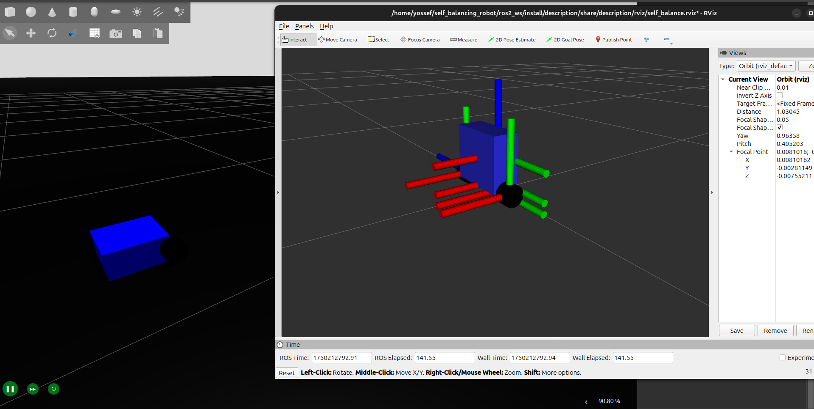
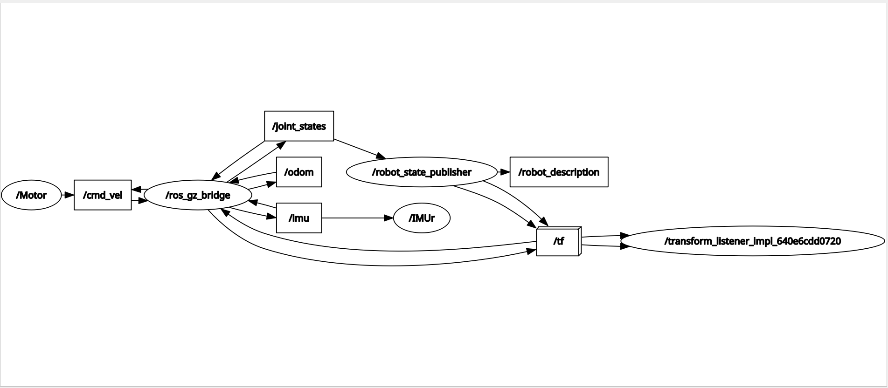
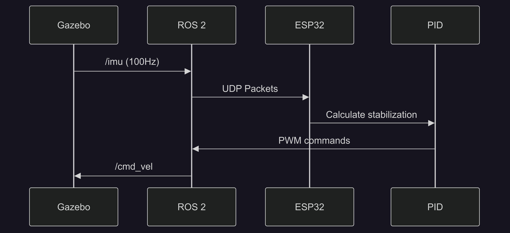

# 🤖 **Self-Balancing Robot: Sim-to-Real HIL Platform**  
**Bridging ROS 2 Simulation and ESP32 Control for Robotic Prototyping**  

---

## 🌟 **Project Vision**  
This project presents a **hardware-in-the-loop (HIL) testbed** that allows for the seamless integration of ROS 2 simulation with real hardware control. The key features include:  
1. **Simulating robot dynamics** using Gazebo (Harmonic) with ROS 2 (Jazzy)
2. **Executing control logic** on a real ESP32 microcontroller  
3. **Bridging both worlds** through real-time data exchange over UDP  

> *"Prototype control algorithms in simulation, then deploy to hardware with minimal changes."*

---

## 🧩 **Key Components**  

### 1. **Gazebo**  
- **Physics**: Simulates a 0.4kg differential-drive robot  
- **Sensors**: Virtual IMU (50Hz), publishing data to `/imu`  
- **Actuators**: Accepts motor control commands via `/cmd_vel`  

  

### 2. **Embedded Brain (ESP32)**  
The ESP32 is tasked with running the control logic and communication interfaces for the system:  
```c
// Core Tasks:
Task 1: PID Control (200Hz)    // Stabilizes robot
Task 2: UDP Server (3333)      // Receives IMU data  
Task 3: UDP Client (3334)      // Sends motor commands
```

---

### 3. **ROS 2 Bridge**  
This component facilitates communication between ROS 2 and the ESP32 via UDP.  
- **ROS → ESP32 (IMU data)**  
  `/imu` → UDP("PITCH,ROLL,YAW") → Port 3333  
- **ESP32 → ROS (Motor commands)**  
  UDP("PWM_L, PWM_R") → `/cmd_vel` → Gazebo

  
---

### 🚀 **Why This Matters**  
Traditional robotic prototyping often involves code divergence between simulation and real hardware, making it hard to test and tune algorithms. This project solves that by enabling the identical code to run in both environments with minimal changes. The benefits include:

| **Traditional Approach** | **This Project** |
|--------------------------|------------------|
| ❌ Sim and hardware code diverge | ✅ Identical code runs in both |
| ❌ Tuning requires physical bot | ✅ PID gains tested in simulation first |
| ❌ Hard to debug real hardware | ✅ Monitor ESP32 while simulating |

---

### ⚙️ **Technical Highlights**  

#### Cross-Stack Synchronization  
This project achieves real-time synchronization between the simulation (Gazebo) and the real-world hardware (ESP32) via UDP communication. The control loop looks like this:



#### **Performance Targets**  
- **Latency**: <15ms end-to-end (sim → ESP32 → sim)  
- **Control Frequency**: 200Hz on ESP32  
- **UDP Reliability**: 99.9% packet delivery  

---

### 🛠️ **Current Challenges**  

#### **Simulation Tuning**  
We are working to match Gazebo physics to real-world behavior, specifically the friction and stiffness parameters. Here's an example of what needs tuning in the robot’s URDF:  
```xml
<gazebo reference="wheel">
    <mu1>1.5</mu1>  <!-- Friction coefficient -->
    <kp>1e6</kp>    <!-- Contact stiffness -->
</gazebo>
```

#### **PID Convergence**  
PID controller tuning is still an ongoing process. Below are the current gains, which require further adjustment:  
```c
// Current Gains (pid_controller.c)
Kp = 25.0;  // Proportional  
Ki = 0.5;   // Integral  
Kd = 5.0;   // Derivative
```
We still need improvements such as anti-windup and derivative filtering.

---

## 🏃 **Getting Started**  

### For Researchers  
Follow these steps to get started:  
1. **Build Project**:  
   ```bash
   # ROS
   cd ros2_ws/
   colcon build --symlink-install
   src install/setup.bash

   #ESP-IDF
   . PathTOYour/esp-idf/export.sh
   cd esp32_firmware/
   idf.py build
   ```

3. **Launch Gazebo simulation**:  
   ```bash
   ros2 launch description sim.launch.py
   ```

4. **Monitor ESP32 outputs**:  
   ```bash
   cd esp32_firmware/
   idf.py -p /dev/ttyUSB0 flash monitor
   ```

### For Contributors  
We welcome contributions! Here are some high-impact areas where you can help:  
1. **`pid_controller.c`**: Improve stabilization  
2. **`imu_publisher.py`**: Fix ENU → NED conversion  
3. **`motor_driver.c`**: Add PWM deadzone compensation  

---

### 📬 **Let’s Collaborate!**  
We’re actively looking for experts and contributors in the following areas:  
- **ROS 2/Gazebo experts** to tune simulation physics  
- **Control theory enthusiasts** to refine PID and stabilization algorithms  
- **Embedded developers** to optimize the UDP communication layer  

---

## 📬 Contact

**Yossef Hady**  
📧 yossefhady007@gmail.com
🔗 [GitHub](https://github.com/yossefhady/) | [LinkedIn](https://www.linkedin.com/in/yossefhady/)


> ❤️ Star this repo if you find it useful or want to follow development!
